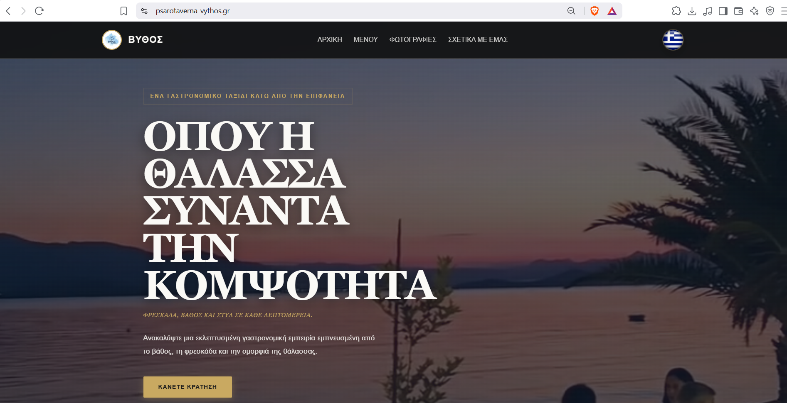
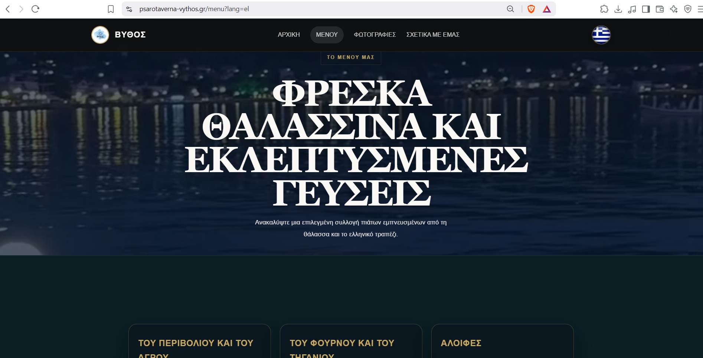
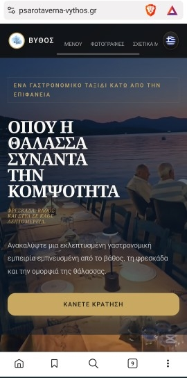
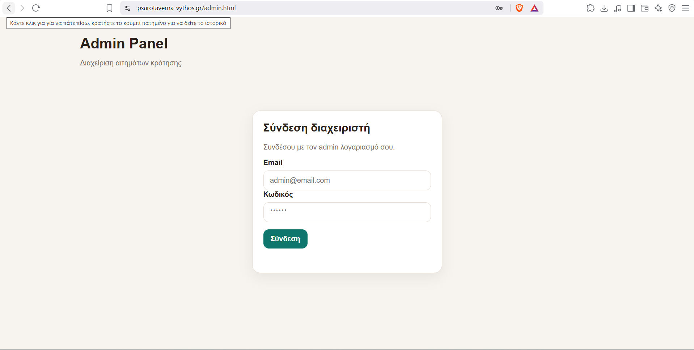
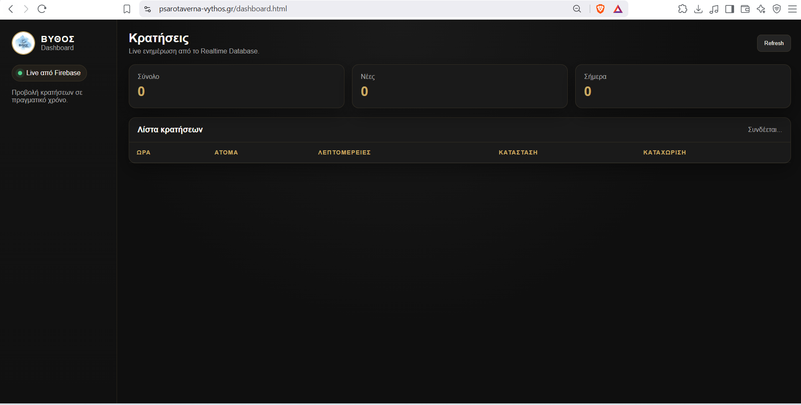

# 🍽 Restaurant Reservation & Administration Platform

A production-ready web application developed for a real restaurant, combining a modern multilingual website with a secure administration panel and a real-time reservation management dashboard.

🌐 **Live Website:** https://psarotaverna-vythos.gr

---

# 📖 Overview

This project was developed for a real restaurant to modernize its online presence and simplify reservation management.

The platform consists of two separate parts:

- 🌐 A responsive public website for customers
- 🔐 A protected administration panel for restaurant staff

Reservations are synchronized in real time using Firebase, allowing administrators to monitor new bookings instantly.

---

# ✨ Features

## 🌐 Public Website

- Modern responsive design
- Restaurant information
- Interactive food menu
- Image gallery
- Reservation request system
- Google Maps integration
- Mobile-friendly layout
- Fast loading performance
- SEO-friendly structure

---

## 🌍 Multilingual Support

The website is fully multilingual and currently supports:

- 🇬🇷 Greek
- 🇬🇧 English
- 🇩🇪 German

Visitors can instantly switch between languages from anywhere on the website.

---

## 🔐 Secure Admin Panel

Administrators can securely access a protected management area using Firebase Authentication.

Features include:

- Email & Password Authentication
- Protected Administrator Access
- Secure Login
- Reservation Management
- Session Protection

---

## 📊 Live Reservation Dashboard

The dashboard provides real-time reservation monitoring using Firebase Realtime Database.

Features include:

- Live reservation updates
- Reservation statistics
- Total reservations
- Today's reservations
- New reservations
- Reservation list
- Instant synchronization
- Manual refresh option

---

# 🚀 Highlights

✔ Production website currently used by a real business

✔ Fully responsive design

✔ Multilingual support

✔ Firebase Authentication

✔ Firebase Realtime Database

✔ Secure administration area

✔ Live reservation monitoring

✔ Mobile optimized

✔ Clean and modern UI

---

# 🛠 Tech Stack

| Technology | Purpose |
|------------|---------|
| HTML5 | Website Structure |
| CSS3 | Styling |
| JavaScript | Frontend Logic |
| Firebase Authentication | Admin Login |
| Firebase Realtime Database | Live Reservations |
| Responsive Design | Mobile Compatibility |

---

# 🏗 Project Structure

```
Public Website
│
├── Home
├── Menu
├── Gallery
├── About
└── Reservation

↓

Firebase

↓

Authentication

↓

Admin Panel

↓

Live Dashboard
```

---

# 📱 Application Preview

## 🌐 Desktop Homepage



---

## 📖 Desktop Menu



---

## 📱 Mobile Homepage



---

## 🔐 Admin Login



---

## 📊 Live Reservation Dashboard



---

# 🔥 Business Problem

The restaurant needed more than a traditional website.

The objective was to provide restaurant staff with a secure and efficient way to monitor customer reservations in real time without relying on phone calls or spreadsheets.

---

# 💡 Solution

I designed and developed a complete web platform including:

- Public website
- Responsive interface
- Multilingual support
- Firebase Authentication
- Protected Admin Panel
- Live Reservation Dashboard
- Real-time synchronization

---

# 🔒 Security

The administration area is protected using Firebase Authentication.

Only authenticated administrators can access reservation management features.

The dashboard retrieves reservation data securely from Firebase in real time.

---

# 📈 Future Improvements

- Online table availability
- Reservation calendar
- Reservation editing
- Email notifications
- SMS notifications
- Analytics dashboard
- Customer management
- Reservation history
- QR Menu integration

---

# 👨‍💻 Author

**George Vasiliou**

GitHub:
https://github.com/geor45

Portfolio:
Coming Soon

---

## ⭐ If you like this project, consider giving it a star.
